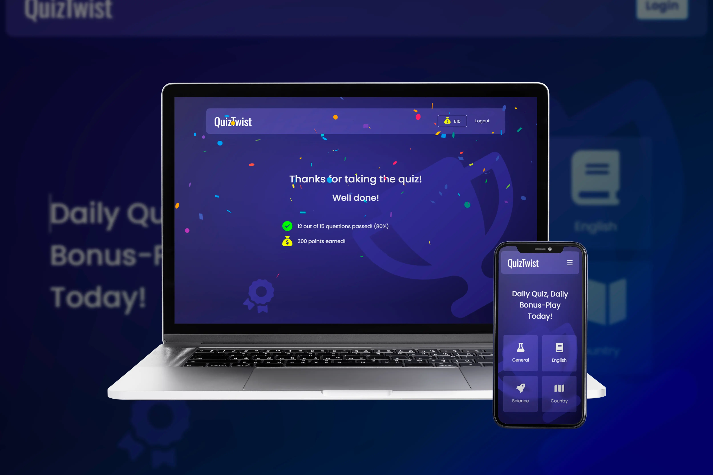
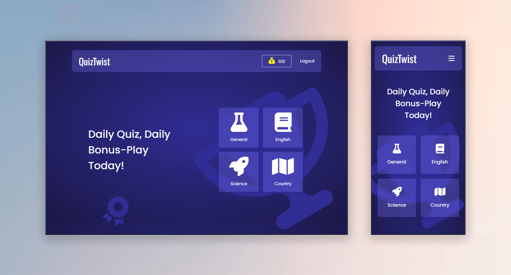
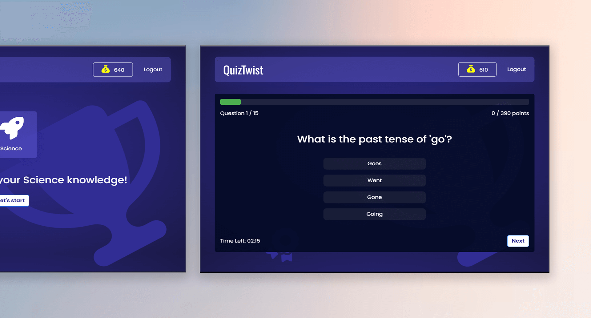

# QuizTwist – Online Quiz

## 📌 Overview

QuizTwist is an engaging quiz application designed to challenge users with 15 questions across various categories. Users can choose from four distinct categories: General, English, Science, and Country. The app also includes a point system, rewarding users with points based on their quiz performance.

QuizTwist features a user-friendly interface where individuals can register, log in, and track their quiz progress. It encourages learning while making the experience fun and competitive through its point-earning mechanism.

🔗 **Live Demo:** <a href="https://quiztwist-frontend.vercel.app/" target="_blank">https://quiztwist-frontend.vercel.app</a>

---

## ✨ Features

- Multiple Categories: Offers four quiz categories - General, English, Science, and Country.
- Point System: Users earn points for each correct answer, motivating them to improve their scores.
- User Authentication: Login and register functionality for tracking quiz results and progress.
- Interactive UI: Easy-to-use interface for navigating quizzes and tracking points.

---

## 🛠️ Technologies Used

**Frontend & Design:**

- HTML
- CSS
- JavaScript
- Bootstrap CSS
- React.js
- MongoDB

**Design Tools:**

- Figma
- Adobe Photoshop

---

## 🖼️ Screenshots

|  |  |
| :----------------------------------------------------: | :----------------------------------------------------: |

---

## 📁 Project Type

- 🎨 Design
- 💻 Development

---

## 📂 Tags

- `Quiz-Application`
- `Education-Tech`
- `Login-Register`
- `Point-System`
- `Web-Application`

## 🙋‍♂️ About the Developer

Hi! I’m **Wilhelmus**, a Full Stack Web Developer and Web Designer passionate about building impactful digital experiences.

- <a href="https://wilhelmus.vercel.app/?ref=github_quiztwist" target="_blank">Portfolio</a>
- <a href="https://www.linkedin.com/in/wilhelmusolejr/" target="_blank">LinkedIn</a>
